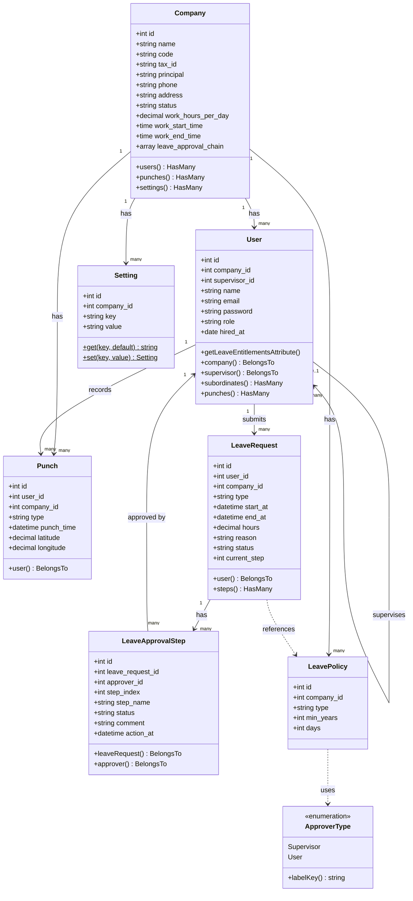

# Punch 系統 UML 類別圖

## 類別說明

| 類別 | 中文名稱 | 說明 |
|------|----------|------|
| `Company` | 公司 | 企業主體，管理員工、打卡紀錄、假別政策與系統設定 |
| `User` | 員工 | 系統使用者，支援主管／下屬的樹狀階層關係 |
| `Punch` | 打卡紀錄 | 記錄員工每次打卡的時間、類型（上班/下班）與位置 |
| `LeaveRequest` | 請假申請 | 員工提交的假單，包含假別、時數與審核狀態 |
| `LeaveApprovalStep` | 審核步驟 | 請假的多層審核流程，每一步對應一位審核人 |
| `LeavePolicy` | 假別政策 | 公司設定各假別的天數規則（可依年資分級） |
| `Setting` | 系統設定 | 鍵值對形式的公司設定，如辦公室位置、打卡範圍 |
| `ApproverType` | 審核人類型 | Enum，定義審核人為「直屬主管」或「指定人員」 |

## 關聯說明

- **Company → User**：一家公司有多名員工
- **Company → Punch**：公司下有多筆打卡紀錄
- **Company → LeavePolicy**：公司設定多種假別政策
- **Company → Setting**：公司有多項系統設定
- **User → Punch**：員工有多筆打卡紀錄
- **User → LeaveRequest**：員工可提交多筆請假申請
- **User → User**：員工可有一位主管，主管可管理多位下屬（自我關聯）
- **LeaveRequest → LeaveApprovalStep**：一筆請假有多個審核步驟
- **LeaveApprovalStep → User**：每個審核步驟由一位員工審核

---

